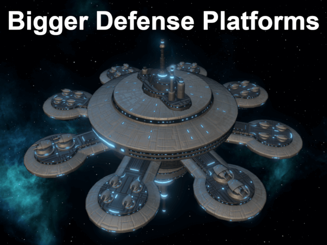

# Bigger Defense Platforms

Stop clicking so much to maintain mid-to-late game starbases! This mod adds 2x and 4x larger defense platforms, unlocked via their own technologies. They are intended to be a linear scaling of the vanilla Defense Ptation so as to avoid introducing balance issues. These new platforms use the existing (but unavailable) Defense Station and Defense Fortress units that ship with the game.

This mod is based on breloom1994's Defense Fortress mod, but rebalanced to fall in line with the vanilla defense platform to avoid starbases becoming over powered. No additional defense platform slots are added, for example.

## Mod Conflicts

### Whole File

Due to the nature of Stellaris modding, chaning various affects to account for the new platform types sometimes requires duplicating entire configuration files, and may conflict with other mod which touch the same files.

Duplicated files:
* `common/static_modifiers/16_static_modifiers_overlord.txt`
* `common/traits/00_admiral_traits.txt`

### Specific Items

As there doesn't currently appear to be a mechanism for attching additional effects to existing edicts, Fortress Proclamation was duplicated in order to make it apply to the new defense platform types.

Duplicated items:
* Fortress Proclamation Edict (from `common/edicts/02_ambitions.txt`)

## Working (Affects new platform types)

* Fortress Proclamation Edict
* Border Guard Admiral Trait

## Not Working (Does NOT affect new platform types)

These appear to be an issue with specific modifiers in some configuration files, and working around it doesn't currently appear to be possible. As such, the following do not correctly apply to the new platform types.

* Bulwark Prefabs Overlord/Subject: Defense Station/Fortress cost and upkeep are not correctly adjusted.
* Fortifier Admiral Trait: Defense Station/Fortress cost and upkeep are not correctly adjusted.

## Links

* [Steam Workshop](https://steamcommunity.com/sharedfiles/filedetails/?id=2728142059)
